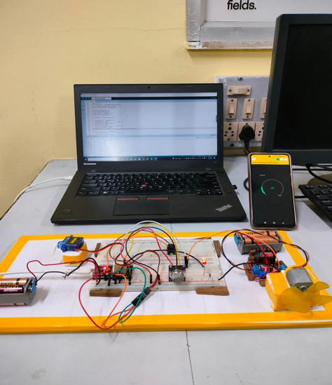

# Smart LPG Gas Leakage Detection & Monitoring System

This project detects LPG gas leaks using an **ESP32**, **MQ-2 Gas Sensor**, **Servo Motor**, **Buzzer**, and **Fan**. It sends alerts via the **Blynk IoT App** and can automatically close the gas valve and ventilate the area.

## Features
- Real-time gas monitoring
- Multi-level gas leak alerts
- Automatic gas valve closure
- Blynk IoT integration for notifications

## Components
- ESP32
- MQ-2 Gas Sensor
- Servo Motor
- L298N Motor Driver
- DC Fan
- Active Buzzer
- Relay Module
- Jumper wires, Breadboard

## Circuit Diagram
 

## How to Run
1. Install Arduino IDE.
2. Install **Blynk** and **ESP32Servo** libraries.
3. Add your Wi-Fi SSID, Password, and Blynk Auth Token in the code.
4. Upload to ESP32.
5. Open Blynk App to monitor gas levels.

## License
MIT License
